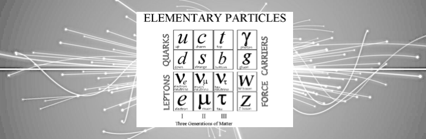

# Particolours - Re-colouring the Standard Model

Plotting the results of [this survey](https://forms.gle/XPpUuzTXuHcS45jL8) on what colours you most associate with various sub-atomic particles. 

The repository contains the raw survey data in .csv format, some jupyter-notebooks for testing and prototyping and final python3 scripts to run the analysis out of the box. The final plots are found in 'plots' and at the following [link](https://jjamieson12.github.io/Particolours/)